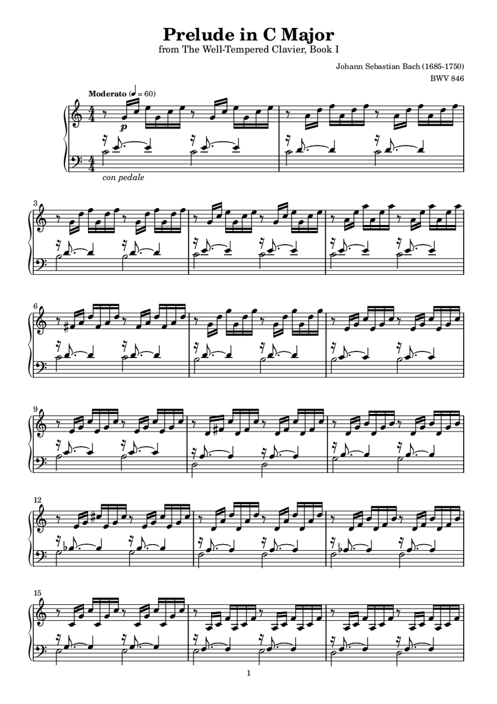

# score-engraver

An [Agent Skill](https://code.claude.com/docs/en/skills) that turns a piano **performance** — an
audio-to-MIDI transcription, a Disklavier capture, a YouTube link — into a **readable, playable
piano score PDF**, the way a human engraver would produce it.

Not a MIDI-to-notation converter. The scripts here only prepare evidence and check the result; the
agent itself writes the LilyPond source, decides hand assignment, voicing, ties, ornaments, chord
symbols and page layout, then looks at the rendered pages and revises.



<sub>Bach BWV 846, engraved from a piano recording: 3 bars per system, 6 systems per page, matching
the Mutopia edition's own division. Note count, durations and staff assignment agree with the
edition at 1.000 / 1.000 / 1.000.</sub>

---

## What makes it different

**The sound is the authority.** The performance MIDI is the base — this score records *this*
performance. A printed edition, a PDF you own, or sheet music visible in a video is a *reference*:
it is used to catch transcription errors (only when the recording actually supports the note), to
learn notation and layout craft, and to settle what MIDI cannot express. It is never copied.

**Reference notes need audio evidence.** `audio_evidence.py` takes every note the score prints but
the transcriber never heard, aligns it to the recording (DTW on pitch-class sets, then a warp
re-anchored on matched notes — no beat map needed), and measures CQT energy at the note's
fundamental and second harmonic against thresholds calibrated on the notes that *were* heard.
Verdicts: `supported` (a pedal-masked tone — keep), `displaced` (played, but not where you wrote
it — fix the rhythm), `weak` (editorial small note, or drop), `unsupported` (printed but not
played — drop). On one pop arrangement this removed 32 notes across 18 bars that the on-screen
sheet showed but the pianist never played.

**Hand assignment is a craft, not a pitch threshold.** `references/hand-assignment.md` holds the
rules a pianist actually uses — a hand that holds a tied note cannot reach a tenth away, the line
owns the note, the busy hand gives and the free hand takes, wide chords are rolled and never
thinned, a note that does not fit is moved rather than deleted — plus twelve patterns observed
against human prints. `playability_lint.py` measures span, reach-while-holding, fast leaps and hand
crossings per bar; every flag has to be answered in the report.

**Layout comes from bar density, not a fixed count.** Bars per system follow how wide each bar
actually is; page breaks are decided after system breaks by counting systems, so middle pages carry
the same number and a section start does not force a new page. `page_balance.py` measures page fill,
right-margin overflow and pages that got *stretched* (too few systems spread to look full).

**Every finished score ships a matching MIDI.** `export_final_midi.py` writes the score's portable
twin: bars and the full tempo map, every time-signature change, key signatures (so an importer
spells G♭ and not F♯), one named track per hand, ties merged. Transposition then costs one command
and keeps every engraving decision.

---

## Install

Requires **LilyPond 2.24+**, **Python 3.11** via [uv](https://docs.astral.sh/uv/), and — only for
links rather than local MIDI — **yt-dlp** and **ffmpeg**. MuseScore is optional (used to convert
reference MIDI to MusicXML, never to engrave).

```bash
brew install lilypond uv yt-dlp ffmpeg          # macOS
git clone https://github.com/CHLIN0/score-engraver.git ~/.claude/skills/score-engraver
bash ~/.claude/skills/score-engraver/scripts/setup.sh
```

`setup.sh` creates `.venv` inside the skill and installs `music21 pretty_midi mido numpy librosa
soundfile pypdfium2`. Every script must be run with that interpreter
(`<skill>/.venv/bin/python`) — the system Python will not do.

For Claude Code the skill is discovered automatically once it sits in `~/.claude/skills/`.
Anywhere else, point your agent at `SKILL.md`.

---

## Use

Just ask, in a session where the skill is available:

```
把這支影片做成鋼琴譜 https://youtu.be/…
engrave this MIDI as a readable piano score
```

The agent runs the pipeline and hands back `score.pdf`, `score.ly`, `final.mid`, per-page PNGs and
`engrave-report.json` (sources accepted and rejected, every lint flag and its disposition, the
readability score per page, what changed in each revision).

Transposing a finished score — no re-engraving, every decision preserved:

```bash
python scripts/transpose_score.py score.ly out/score.ly --from ges --to f --tag "F major"
# key: ges \major -> F (1 accidentals)      6 flats become 1
# key: aes \major -> G (1 accidentals)      the mid-piece modulation follows
```

It prints the accidental count for each resulting key so you can pick the enharmonic (`--to eis`
would produce E♯ and F𝄪 — obviously wrong). Re-render, then re-run `page_balance.py` (accidental
count changes bar widths) and `playability_lint.py` (the intervals are identical but the black/white
key geometry is not), and check `\ottava` and ledger lines.

---

## How it works

| # | Step | Tooling | Who |
|---|------|---------|-----|
| 0 | Source dossier and web references | `source_dossier.py` (yt-dlp + ffmpeg, staff detection in video frames), `web_references.py` (Mutopia, IMSLP, YouTube, Wikipedia) | script |
| 1 | Audio → performance MIDI | Transkun or any AMT | script |
| 2 | Analysis | `analyze_midi.py` — key windows, tempo, range, notes per bar | script |
| 3 | Beat map | `align_to_reference.py` (DTW) / constant bpm / `beats_from_midi.py` / `beats_from_anchors.py` | script |
| 4 | Quantized draft | `quantize_to_score.py` → MusicXML → `score_to_lily.py` → draft `.ly` | script |
| 5 | **Engraving** | the agent edits `score.ly`: hands, voices, ornaments, 8va, slurs, chord symbols, lyrics, breaks | agent |
| 6 | Render and check | `render_ly.sh`, then the five checks below; the agent reads every page image | both |
| 7 | Revision | defect list → edit → re-render, at most two rounds | agent |
| 8 | Threshold (when ground truth exists) | `compare_scores.py` — onset F1, duration, staff agreement | script |
| 9 | Final MIDI | `export_final_midi.py` | script |

### The five checks

| Check | Reads | Catches |
|---|---|---|
| `verticals_lint.py` | score MIDI + performance MIDI | simultaneities the performance never played; bars where the score has far more attacks than the recording; octave errors from `\ottava`; hands out of sync |
| `playability_lint.py` | score MIDI (one track per staff) | span over a ninth, reach while holding, fast leaps, hand crossings — per bar |
| `audio_evidence.py` | score MIDI + performance MIDI + audio | printed notes the recording does not support (four verdicts, thresholds self-calibrated on the recording) |
| `page_balance.py` | page images | page fill, right-margin overflow, stretched pages, per-system density |
| the agent's eyes | page images + references | crowding, awkward spellings, missing rolls — scored against `references/readability-rubric.md` (R1–R10) |

---

## Layout

```
SKILL.md                     the agent's instructions (Traditional Chinese)
assets/popular-piano.ily     house style: A4, staff size, chord-symbol formatting, \ottava and pedal helpers
references/
  hand-assignment.md         which hand takes which note, and why — with observed patterns
  readability-rubric.md      R1–R10, the acceptance rubric
  lilypond-cookbook.md       breaks that hold, dense textures, sounding-pitch \ottava, tempo marks
  notation-rules.md          conventions a pianist expects
  style-target.md            what "popular published sheet" means here
  reference-sources.md       Mutopia, PDMX, IMSLP, YouTube — how to reach each, and their defects
  known-pieces.md            catalogue facts worth checking before trusting a hint
  lessons.md                 every improvement cycle: what broke, what fixed it
scripts/                     the tools in the table above
scripts/_archive/            v1-era scripts kept for history, on no current path
```

---

## Limits

- Piano solo. Other instrumentations are untested.
- Not OMR: it never reads notation out of an image as data. Video frames and reference PDFs are
  read by the agent's own vision, as a reference, and every reading is checked against the recording.
- The readability rubric is scored by the agent itself; there is no pianist in the loop.
- `audio_evidence.py` needs the recording. With only a MIDI file, printed-but-unplayed notes cannot
  be distinguished from pedal-masked ones.
- IMSLP downloads cannot be automated (JS redirect plus a save dialog); a human saves the PDF into
  `out/refs/imslp/` and it is deleted after use.
- LilyPond's MIDI shortens staccato, so duration metrics are taken from an articulation-stripped
  copy (`score_midi_for_compare.sh`), and `final.mid` uses notated durations by default.

## Provenance

Built and refined over seven cycles against real material — four public-domain classical pieces with
machine-readable editions as ground truth, and two pop arrangements with human transcriptions as a
reference. Each cycle: an agent engraved the pieces from the skill as written, the results were
compared page by page and note by note against the editions and the recordings, and the skill,
scripts and reference documents were corrected. `references/lessons.md` records all of it.
